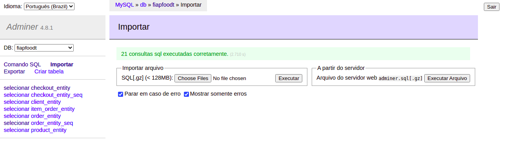

# Fiap-food


Fast food self-service

## Prerequisites:
- Apache Maven 3.+
- JDK 20
- Docker 20+
- Docker Compose 1.22.+

## Start application in Docker container with Mysql DB in Docker:
```
    docker-compose up -d
```

## Stop all applications in Docker containers:
```
    docker-compose stop
```

## Start application in Docker container with Mysql DB in Docker and rebuild service image:
```
    docker-compose up --build --force-recreate --no-deps -d 
```

## Swagger documentation:
```
    http://localhost:8080/swagger-ui.html
```

## Database access via Adminer:
```
    http://localhost:8282/
```


* **Infos**:
  * User = **root** 
  * password = **password**
  * Database = **fiapfoodt**


**OBS: If you want to prepopulate the database, we have a script with some essential random inserts and it can be performed on the import screen**

Link to import sql file:
```http://localhost:8282/?server=db&username=root&db=fiapfoodt&import=```

SQL file `src/main/resources/scripts/population-db.sql`



## Start application with Kubernetes

1 - Start database with Docker

```
    docker-compose up db -d
```

2 - Modify secret.yaml file with database credentials
    
3 - Create the secret object with the secret.yaml file
```
    kubectl apply -f /kubernetes/secret.yaml
```
4 - Create the other resurces
```
    kubectl apply -f /kubernetes/service.yaml
    kubectl apply -f /kubernetes/deployment.yaml
```

